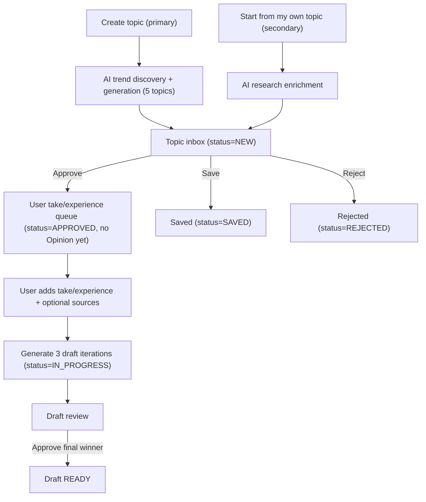

# PRD: LinkedIn PR Agency — AI-Generated Topics Primary Flow (v1)

Last updated: **2026-04-16**

Freshness policy: This PRD is considered **outdated if it has not been updated in the last 7 days**.

## Overview
LinkedIn PR Agency is a mobile-first web app that helps a solo creator turn current, trending topics into publish-ready LinkedIn posts with minimal friction:

1) AI generates candidate topics (primary entry point)  
2) User approves/rejects topics  
3) User adds personal context (“experience/take”)  
4) AI drafts 3 iterations  
5) User selects and approves a final winner

This repo currently uses **Next.js + Prisma + Postgres**. AI features are optional and should degrade gracefully when `OPENAI_API_KEY` is not set.

## Persona
**Primary persona: Solo creator**
- Needs a steady pipeline of relevant topics
- Wants a fast “approve → add context → draft → approve final” loop from phone

## Goals
- Make “Create topic” produce **AI-generated trending topics** by default (primary flow).
- Keep topics in a clear set of queues so the creator always knows the next action.
- Ensure each topic has an opinion angle and best-effort sources/citations.

## Non-goals (v1)
- Authentication, roles, multi-user collaboration.
- Auto-posting to LinkedIn, scheduling, notifications, email.
- Guaranteed citations for every topic (citations are best-effort).

## Data model (existing)
This PRD assumes the following entities already exist in the codebase:
- `Topic` with fields like `title`, `summary`, `opinionPitch`, `whyItMatters`, `status`
- `TopicSource` (URLs per topic, up to 10 unique)
- `Opinion` (creator’s personal context / take)
- `Draft` (generated variants and revisions)
- `ResearchRun` (AI or research outputs like takes/evidence pack)

### Statuses (existing)
- `TopicStatus`: `NEW | APPROVED | REJECTED | SAVED | IN_PROGRESS`
- `DraftStatus`: `DRAFT | REVIEW | READY | PUBLISHED | ARCHIVED`

## Primary flow: AI-generated topics (default “Create topic”)
### Entry point
User clicks **Create topic**. This triggers AI trend discovery + topic generation.

### Batch size + targeting + citations (locked)
- Batch size: **5 topics per run**
- Targeting: **global tech/business trends**
- Citations: **best-effort** (0–10 URLs per topic; try to provide 2–5 when possible)

### Output per generated topic (required shape)
For each of the 5 topics, the system must produce:
- `title` (string)
- `summary` (string; 1–3 sentences)
- `opinionPitch` (string; suggested angle)
- `whyItMatters` (string; relevance/impact)
- `sources[]` (array of URLs; 0–10; best-effort)

### Queue placement
Each generated topic is persisted as a `Topic` with:
- `status = NEW`
- `sources` created as `TopicSource` records (deduped per topic)

All generated topics appear in the **Topic inbox** queue for triage.

## Secondary flow: user-provided topic (“Start from my own topic”)
### Entry point
User chooses **Start from my own topic** and enters:
- `title` (required)
- `summary` (optional)

### AI research enrichment (best-effort)
System researches the topic and populates:
- `opinionPitch`
- `whyItMatters`
- `sources[]` (0–10 URLs; best-effort)

### Queue placement
The enriched topic is persisted as a `Topic` with:
- `status = NEW`
Then it appears in the **Topic inbox** queue for triage.

## Queues & transitions (v1)
The product must present these conceptual queues (they may map to pages/routes differently over time):

1) **Topic inbox** (`Topic.status = NEW`)
   - User decisions: `APPROVED | SAVED | REJECTED`
2) **User take / experience queue**
   - Condition: `Topic.status = APPROVED` and no `Opinion` exists for the topic yet
   - Purpose: user adds personal context (“experience/take”) and optional extra sources
3) **Draft review**
   - Condition: drafts exist for topic
   - Purpose: review 3 AI variants, optionally regenerate, edit, and approve final

### State transitions (required)
- `NEW → APPROVED | SAVED | REJECTED`
- When user submits take/experience: `APPROVED → IN_PROGRESS` and an `Opinion` is created
- Draft generation creates 3 `Draft` records for the topic
- User selects a final winner by marking a specific draft `READY` (“Approve final winner”)

## AI I/O contracts (high-level, v1)
These describe inputs/outputs at the product level; implementation details (providers, prompts, retrieval methods) are not part of this PRD.

### A) Trend discovery + topic generation
**Input**
- Targeting: global tech/business trends
- Count: 5

**Output (per topic)**
- `title`, `summary`, `opinionPitch`, `whyItMatters`, `sources[]`

**Failure behavior**
- If AI/search fails, show an error and do not create partial topics silently.
- If citations cannot be found quickly, allow `sources=[]` (best-effort policy).

### B) User-provided topic research enrichment
**Input**
- `title`, optional `summary`

**Output**
- `opinionPitch`, `whyItMatters`, `sources[]`

**Failure behavior**
- Allow saving the topic with whatever is available; missing fields should not block inbox triage.

### C) Draft generation (3 iterations)
**Input**
- Topic fields + sources
- User take/experience (Opinion core take + optional extra context)

**Output**
- 3 draft variants

**Failure behavior**
- If AI fails, provide a deterministic fallback (or a clear error) and keep user data intact.

## Success metrics (v1)
Primary: **Draft quality**
- % of topics that reach a `READY` draft
- Median revisions per topic before `READY`

Secondary:
- Time from “topic created” to “first drafts generated”
- Time from “first drafts generated” to “READY”

## Acceptance criteria (v1)
An implementer can build the product such that:
1) Clicking **Create topic** generates **5** AI topics (trending tech/business), each with an opinion angle and best-effort sources, and saves them into the **NEW inbox**.
2) Choosing **Start from my own topic** triggers research enrichment (opinion + sources) and saves into the **NEW inbox**.
3) Approved topics appear in a **user take/experience** queue until an opinion is captured.
4) Submitting the user’s experience/take generates **3** draft iterations.
5) The user can select and approve a final winner, marking a draft as **READY**.

## Flow diagram

